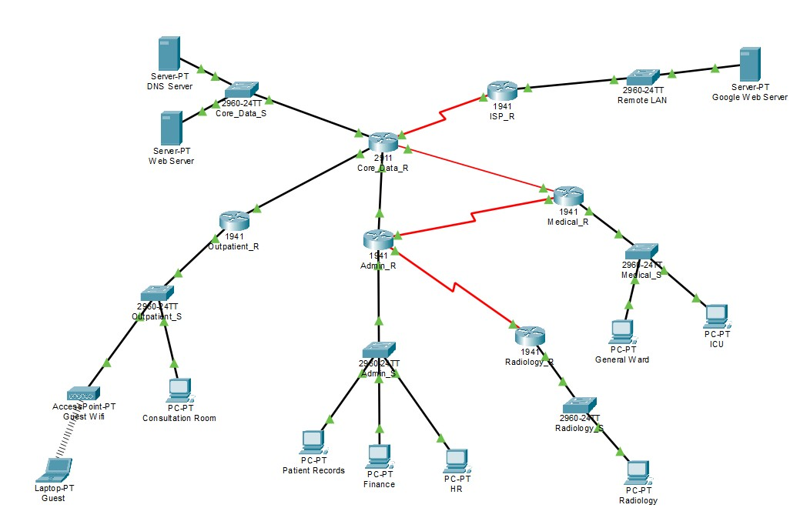
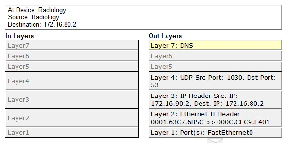
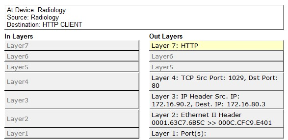

# Introduction and Problem Statement


# Team Contribution Statement

# Addressing Scheme and Justification

# Network Foundations

# Medium Comparison

# Verification, Failover, and Design Reasoning
Before

```
Medical_R>show ip route
Codes: L - local, C - connected, S - static, R - RIP, M - mobile, B - BGP
       D - EIGRP, EX - EIGRP external, O - OSPF, IA - OSPF inter area
       N1 - OSPF NSSA external type 1, N2 - OSPF NSSA external type 2
       E1 - OSPF external type 1, E2 - OSPF external type 2, E - EGP
       i - IS-IS, L1 - IS-IS level-1, L2 - IS-IS level-2, ia - IS-IS inter area
       * - candidate default, U - per-user static route, o - ODR
       P - periodic downloaded static route

Gateway of last resort is 172.16.102.1 to network 0.0.0.0

     172.16.0.0/16 is variably subnetted, 18 subnets, 2 masks
O       172.16.10.0/24 [110/3] via 172.16.102.1, 00:01:53, GigabitEthernet0/0/0
O       172.16.20.0/24 [110/3] via 172.16.102.1, 00:01:53, GigabitEthernet0/0/0
O       172.16.30.0/24 [110/3] via 172.16.102.1, 00:01:53, GigabitEthernet0/0/0
C       172.16.40.0/24 is directly connected, GigabitEthernet0/1.40
L       172.16.40.1/32 is directly connected, GigabitEthernet0/1.40
C       172.16.50.0/24 is directly connected, GigabitEthernet0/1.50
L       172.16.50.1/32 is directly connected, GigabitEthernet0/1.50
O       172.16.60.0/24 [110/3] via 172.16.102.1, 00:01:53, GigabitEthernet0/0/0
O       172.16.70.0/24 [110/3] via 172.16.102.1, 00:01:53, GigabitEthernet0/0/0
O       172.16.80.0/24 [110/2] via 172.16.102.1, 00:01:53, GigabitEthernet0/0/0
O       172.16.90.0/24 [110/67] via 172.16.102.1, 00:01:53, GigabitEthernet0/0/0
O       172.16.100.0/24 [110/2] via 172.16.102.1, 00:01:53, GigabitEthernet0/0/0
O       172.16.101.0/24 [110/2] via 172.16.102.1, 00:01:53, GigabitEthernet0/0/0
C       172.16.102.0/24 is directly connected, GigabitEthernet0/0/0
L       172.16.102.2/32 is directly connected, GigabitEthernet0/0/0
C       172.16.103.0/24 is directly connected, Serial0/1/0
L       172.16.103.1/32 is directly connected, Serial0/1/0
O       172.16.104.0/24 [110/66] via 172.16.102.1, 00:01:53, GigabitEthernet0/0/0
O*E2 0.0.0.0/0 [110/1] via 172.16.102.1, 00:01:53, GigabitEthernet0/0/0
```
After

```
Medical_R>show ip route
Codes: L - local, C - connected, S - static, R - RIP, M - mobile, B - BGP
       D - EIGRP, EX - EIGRP external, O - OSPF, IA - OSPF inter area
       N1 - OSPF NSSA external type 1, N2 - OSPF NSSA external type 2
       E1 - OSPF external type 1, E2 - OSPF external type 2, E - EGP
       i - IS-IS, L1 - IS-IS level-1, L2 - IS-IS level-2, ia - IS-IS inter area
       * - candidate default, U - per-user static route, o - ODR
       P - periodic downloaded static route

Gateway of last resort is 172.16.103.2 to network 0.0.0.0

     172.16.0.0/16 is variably subnetted, 16 subnets, 2 masks
O       172.16.10.0/24 [110/65] via 172.16.103.2, 00:02:42, Serial0/1/0
O       172.16.20.0/24 [110/65] via 172.16.103.2, 00:02:42, Serial0/1/0
O       172.16.30.0/24 [110/65] via 172.16.103.2, 00:02:42, Serial0/1/0
C       172.16.40.0/24 is directly connected, GigabitEthernet0/1.40
L       172.16.40.1/32 is directly connected, GigabitEthernet0/1.40
C       172.16.50.0/24 is directly connected, GigabitEthernet0/1.50
L       172.16.50.1/32 is directly connected, GigabitEthernet0/1.50
O       172.16.60.0/24 [110/67] via 172.16.103.2, 00:02:42, Serial0/1/0
O       172.16.70.0/24 [110/67] via 172.16.103.2, 00:02:42, Serial0/1/0
O       172.16.80.0/24 [110/66] via 172.16.103.2, 00:02:42, Serial0/1/0
O       172.16.90.0/24 [110/129] via 172.16.103.2, 00:02:42, Serial0/1/0
O       172.16.100.0/24 [110/66] via 172.16.103.2, 00:02:42, Serial0/1/0
O       172.16.101.0/24 [110/65] via 172.16.103.2, 00:02:42, Serial0/1/0
C       172.16.103.0/24 is directly connected, Serial0/1/0
L       172.16.103.1/32 is directly connected, Serial0/1/0
O       172.16.104.0/24 [110/128] via 172.16.103.2, 00:02:42, Serial0/1/0
O*E2 0.0.0.0/0 [110/1] via 172.16.103.2, 00:02:42, Serial0/1/0
```

# Protocol Analysis


<div style="display: flex; justify-content: center; gap: 20px; align-items: stretch;">
  <figure style="text-align: center; width: 45%;">
    
    <figcaption>DNS Request</figcaption>
  </figure>

  <figure style="text-align: center; width: 45%;">
    
    <figcaption>HTTP Request</figcaption>
  </figure>
</div>

